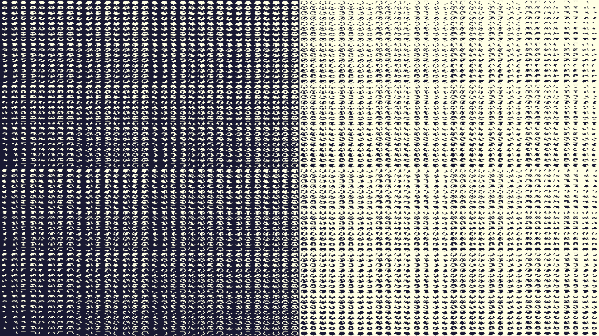
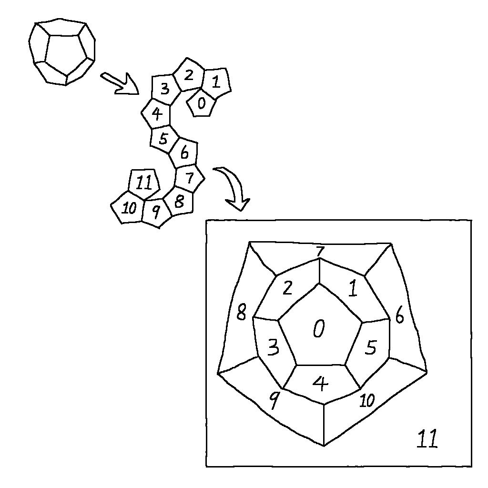

The vote rule(AKA majority rule) cellular automata run on a dodecahedron. The rule is that each cell follows the color of the majority of its neighbours. Each face of a dodecahedron is a cell. All 4096 possible initial global states are run and displayed on the screen.

The dodecahedron is visualized as flattened, with each face labeled in such manner

*Space* to step, *R* to restart.

Needs numpy, pyglet, moderngl.